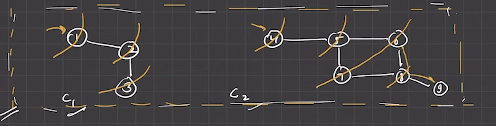
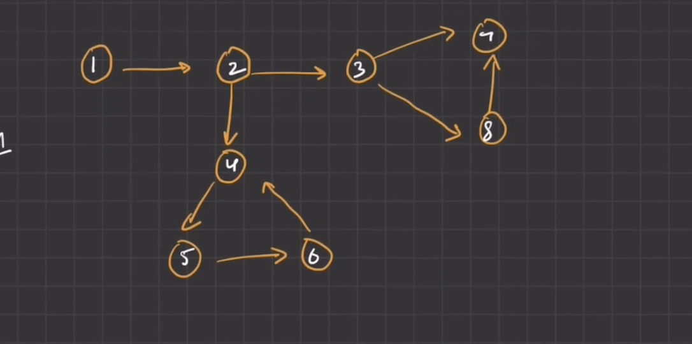

### Why does graph came if trees was there ? Difference

## Tree :

- acyclic
- no cycles allowed
- always connected
- always have parent child relationship
- always has direction
- always has one root
- preorder , inorder and postorder traversal
- family tree , file system

## Graph
- may have cycles
- cycles allowed
- may be disconnected
- no fixed parent-child
- can be directed or undirected
- varies can be more or less
- bfs, dfs, dijikstra etc
- social network , map and web links

### We can represent a graph using either of these two methods.

## Adjacency List: 
- It is a collection of lists or arrays.
- Each vertex has a list of all the vertices it is connected to.
- It is more space-efficient for sparse graphs.

 
example : {
    "A" : ["C","D","F"],
    "B" : ["F","D","C"]
}

## Adjacency Matrix:
- It is a 2D array (matrix) where both rows and columns represent vertices.
- The cell at row i and column j indicates whether there is an edge between vertex i and vertex j.
- It is easier to implement but can be less space-efficient for sparse graphs.

 example : [
    [0,1,1,1],
    [1,0,1,0],
    [1,1,0,1],
    [0,1,1,0]
 ]

### Advantages and Disadvantages of Adjacency Matrix and Adjacency list

## Example : 

you have 10k nodes, and node sirf 2 nodes se connected h.
- matrix: 10k *10k = 100 million entries
- List: bas 10k nodes+ 20k edges = 20k-30k entries

Matrix will waste huge memory space

### TL;DR

- Adjacency Matrix → Fast lookup, more space
- Adjacency List → Space-efficient, little slower lookup

### Undirecred graph : cycle detection 

👉 agar hum kisi already visited node pe ja rahe hain jo parent nahi hai,
to ye cycle hai.

for example: 
1 -> 2
2 -> 1,3
3 -> 2

4-> 5,6
5-> 6,4, 7
7 -> 5,8
8 -> 6, 7(already visited node and this is not a parent) , 9 
mtlb cylic

### Most common approach (DFS)
- har node k lie DFS lagao
- Maintain visited set and parent
- agar koi neighbour visited hai aur parent nahi hai -> cycle found

### Directed Graph : cycle detection

4,5,6 cycle present

### how do we do this by code ?

- We use DFS traversal with two sets (or arrays):

- visited → ye batata hai ki node kabhi visit hua hai ya nahi.

- recStack (recursion stack) → ye batata hai ki current DFS path me kaunsa node active hai.

- Agar DFS karte waqt kisi neighbor ko visit karte hue wo neighbor recStack me already present hai,

- matlab hum same path pe wapas ghoom gaye → cycle detected 🔁

### Algorithm Steps:

- Har node ke liye DFS call lagao agar wo visited nahi hai.

- Jab ek node DFS me enter ho:

- visited[node] = true

- recStack[node] = true

- Uske neighbors traverse karo:

- agar neighbor visited nahi → DFS call

- agar neighbor recStack me already true → ✅ cycle found

- Jab node se backtrack karo → recStack[node] = false

### Topological Sort Using DFS
-> directed acyclic graph

-> topological sort is linear order of vertices such that for every edge (u-v) u always appears before v in that ordering

### Topological Sort Using Kahns Algorithm  

 
