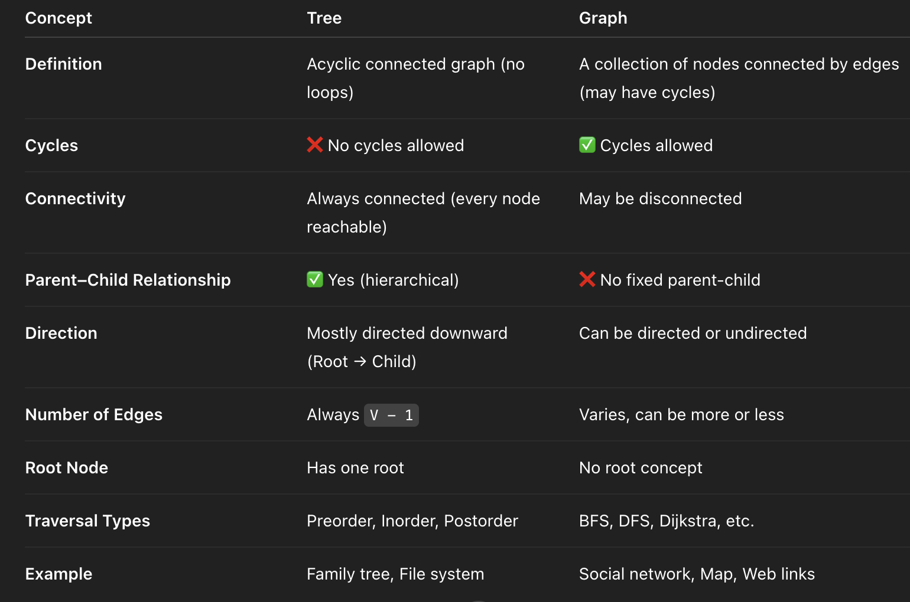
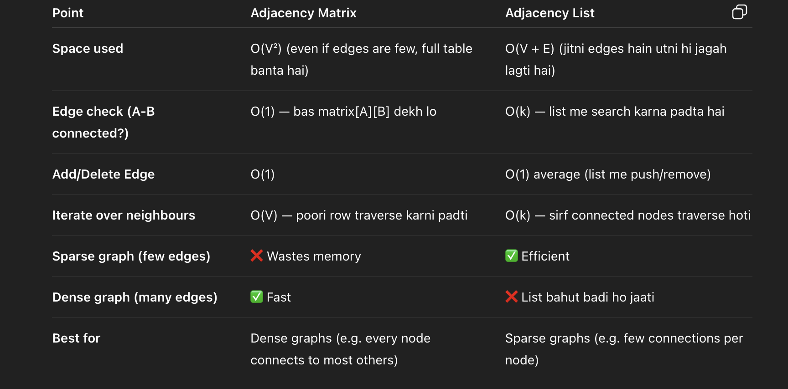

### Why does graph came if trees was there ? Difference

## Tree :

- acyclic
- no cycles allowed
- always connected
- always have parent child relationship
- always has direction
- always has one root
- preorder , inorder and postorder traversal
- family tree , file system

## Graph
- may have cycles
- cycles allowed
- may be disconnected
- no fixed parent-child
- can be directed or undirected
- varies can be more or less
- bfs, dfs, dijikstra etc
- social network , map and web links

### We can represent a graph using either of these two methods.

## Adjacency List: 
- It is a collection of lists or arrays.
- Each vertex has a list of all the vertices it is connected to.
- It is more space-efficient for sparse graphs.

 
example : {
    "A" : ["C","D","F"],
    "B" : ["F","D","C"]
}

## Adjacency Matrix:
- It is a 2D array (matrix) where both rows and columns represent vertices.
- The cell at row i and column j indicates whether there is an edge between vertex i and vertex j.
- It is easier to implement but can be less space-efficient for sparse graphs.

 example : [
    [0,1,1,1],
    [1,0,1,0],
    [1,1,0,1],
    [0,1,1,0]
 ]

### Advantages and Disadvantages of Adjacency Matrix and Adjacency list

## Example : 

you have 10k nodes, and node sirf 2 nodes se connected h.
- matrix: 10k *10k = 100 million entries
- List: bas 10k nodes+ 20k edges = 20k-30k entries

Matrix will waste huge memory space

### TL;DR

- Adjacency Matrix → Fast lookup, more space
- Adjacency List → Space-efficient, little slower lookup

