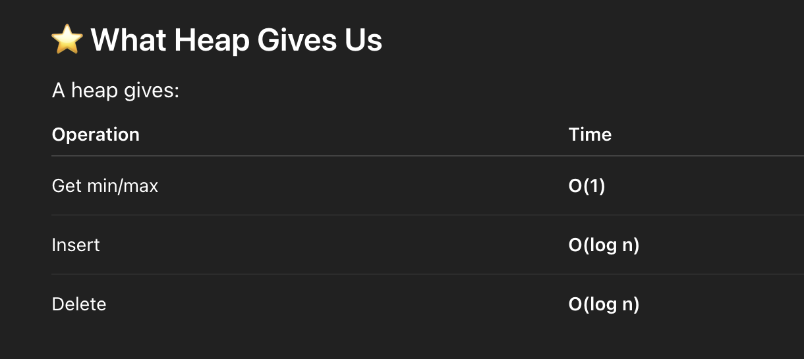

### Why Heap Came (Why Do We Need Heaps?)

A heap was introduced because sometimes we need to quickly get the minimum or maximum element from a changing set of numbers.

👉 Without a heap

## If you store numbers in:

1. Array → finding min/max = O(n)

2. Sorted array → insert/delete = O(n)

3. Tree (BST) → insert/delete/find = O(log n) but must be balanced

4. Priority queue using list → slow operations

## But some problems need:

1. ⚡ Fast access to min/max
2. ⚡ Fast insertion
3. ⚡ Fast deletion

At the same time.

This is where heap came.

### HEAP

A heap is a specialized tree-based data structure that is a complete binary tree and follows the heap property: 
- in a max heap, a parent node's value is always greater than or equal to its children's values, 
- and in a min heap, it is always less than or equal to its children's values

### Heap Property

- for every node, the value of its children is greater than or equal to its own value.
- usually used to implement priority queues, where the smallest (or largest) element is always at the root of the tree.

### how to find parent element

- parent = i // 2 (or (i-1)/2 in 0-based)

- left = 2*i

- right = 2*i + 1

### Insertion algorithm — step-by-step (general, clearly)

(Assume Max-heap; for Min-heap reverse comparisons)

Append element at end of array (maintains completeness).

1. Let i = index_of_new_element.

2. While i > 0 and A[i] > A[parent(i)]:

3. swap A[i] and A[parent(i)]

4. set i = parent(i) (move up)

5. Stop when parent is larger (for max-heap) or reached root.

6. Time complexity: O(log n) (height of heap).

### Deletion (Extract root) algorithm — step-by-step (Max-heap)

Save root value (this is max).

1. Move last element to root position A[0] = A[last] and remove last element (shrink array).

2. Down-heapify / bubble-down from index i = 0:

3. while i has at least one child:

4. pick largestChild = index of larger child (right or left)

5. if A[i] < A[largestChild] swap them and i = largestChild

6. else break

7. Return saved root.

8. Time complexity: O(log n).

### Deletion
- we cant directly delete node in heap because of the AST tree
- ya to you can delete root node or else complete nodes starting from right 